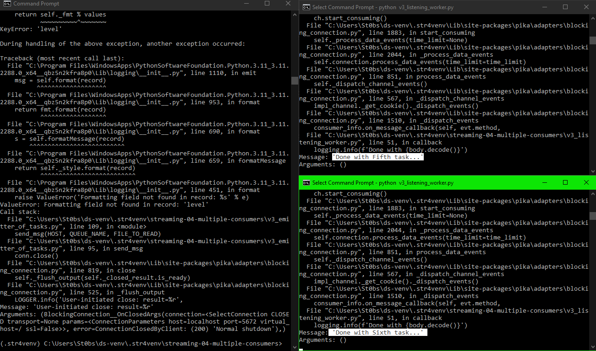

# streaming-04-multiple-consumers

> Use RabbitMQ to distribute tasks to multiple workers

One process will create task messages. Multiple worker processes will share the work. 

### Author: Solomon Stevens
### Date: May 24, 2024

## Steps

### Execute the Producer

Run emitter_of_tasks.py (say y to monitor RabbitMQ queues if asked)

Explore the RabbitMQ website.

### Execute a Consumer / Worker

Run listening_worker.py
* Consumers / Workers shouldn't terminate on their own.
* You'll have to manually close each one (CTRL + C)

### Ready for Work

Use your emitter_of_tasks.py to produce more task messages.

### Start Another Listening Worker 

Use your listening_worker.py script to launch a second worker. 

## Reference

- [RabbitMQ Tutorial - Work Queues](https://www.rabbitmq.com/tutorials/tutorial-two-python.html)

## Screenshot

See a running example with at least 3 concurrent process windows here:

